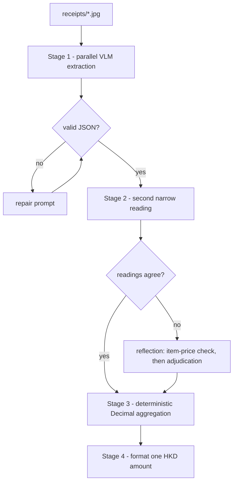

# FTEC5660 Homework 1: Receipt Chain

Build a LangChain pipeline that reads every supermarket receipt in a folder
with the vision-capable DeepSeek Flash model and answers these two questions:

1. How much money did I spend in total for these bills?
2. How much would I have had to pay without the discount?

For this homework, **amount spent** means the final payment after the receipt's
rounding line. **Without the discount** means the sum of the original positive
item prices: add back every promotion, coupon, member, app, packaging-damage,
and percentage discount, but do not add back rounding.

## Student task

Only edit the two functions in `hw1.py` that contain `### YOUR CODE HERE`:

- `build_chain()` creates your LangChain chain.
- `answer_queries()` runs the chain on the receipt images and returns one final
  response for each question.

You may use prompt chaining, routing, parallel calls, reflection, or a
combination. Your final responses should each contain one HKD amount. Do not
hard-code filenames or public answers; grading uses unseen receipt folders.

## Setup and public test

```bash
python3 -m venv .venv
source .venv/bin/activate
pip install -r requirements.txt
```

Put your DeepSeek key after `DEEPSEEK_API_KEY=` in `.env`, then run:

```bash
python3 hw1.py --image-folder public_test
```

The program creates `results.csv` in the current directory. Its columns are
`query`, `model_response`, and `correctness`. The public answers are in
`public_test/ground_truth.json`. The starter intentionally returns the dummy
response `please design your chain to answer these two queries.` so it runs
before you add any API code.

The required model is `deepseek-v4-flash-vision-exp`, the vision-capable
DeepSeek Flash model. JPEG, PNG, GIF, and WebP inputs are accepted by the
homework runner.


## Homework 1 solution:

### Chain design



| Stage | Pattern | What happens |
| --- | --- | --- |
| 1 | Parallelization | One vision call per receipt, run concurrently; each returns a structured JSON record |
| 2 | Exception handling & recovery | If the text is not parseable JSON, a repair prompt re-emits valid JSON; one extra attempt covers transient API failures |
| 2b | Reflection / evaluator-optimizer | A second, deliberately narrow reading asks only for SUBTOTAL, the discount total and the payment. If the two readings disagree, the sum of the original item prices breaks the tie (it must equal SUBTOTAL plus discounts); otherwise the image is sent back with both candidates for one careful re-read, and the median is taken |
| 3 | Prompt chaining handoff | Deterministic Python step: `paid = amount_paid`, `without_discount = subtotal + every discount added back as a positive number` (rounding is never added back), accumulated with `Decimal` |
| 4 | Guardrail | Output is formatted by code as `HK$1974.30` so each response contains exactly one number |

### Solution

The chain splits receipt understanding into two heterogeneous jobs: reading pixels and doing arithmetic. 

Stage 1 sends every receipt to `deepseek-v4-flash-vision-exp` in parallel and asks only for a narrow structured record (item lines, discount lines with their printed signs, the printed SUBTOTAL, the ROUNDING line, and the final payment line), explicitly forbidding the model from computing any total. 

Stage 2 adds reliability rather than trusting a single pass: malformed output goes through a repair prompt, and every receipt is read a second time by a deliberately different prompt that ignores products and reports only SUBTOTAL, the discount total and the payment. When the two readings disagree, the tie is broken deterministically first — on any receipt, SUBTOTAL plus the discounts must equal the sum of the original item prices, so the item prices vote for the consistent reading — and only if that fails is the image sent back with both candidates for an adjudicated re-read, after which the median is taken. 

Stage 3 performs the aggregation in deterministic Python with `Decimal`: question one sums each receipt's `amount_paid`, question two sums `subtotal + sum(abs(discounts))` while deliberately excluding the rounding line, because LLM arithmetic is unreliable and because keeping the model away from the final number guarantees the response contains exactly one amount. This follows the prompt-chaining principle of narrow, checkable stages with deterministic processing in between: the JSON record is the explicit interface between stages, the numeric work is fully auditable, and accuracy on unseen receipts depends on extraction quality rather than on the model's ability to add.

### Setup

```bash
python3 -m venv .venv
source .venv/bin/activate
pip install -r requirements.txt
cp .env.example .env      # then paste your key after DEEPSEEK_API_KEY=
python3 hw1.py --image-folder public_test
cat results.csv
```

Set `HW1_DEBUG=1` to print per-receipt amounts to stderr while tuning the prompt.

### Defensive behaviour

Any unrecoverable failure on a receipt contributes zero instead of raising, so the run always finishes and always writes `results.csv`.

